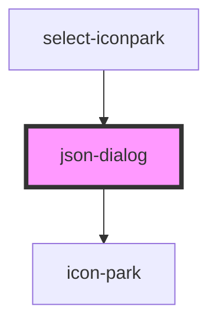

# select-iconpark

<!-- Auto Generated Below -->

## Properties

| Property       | Attribute       | Description | Type      | Default     |
| -------------- | --------------- | ----------- | --------- | ----------- |
| `cancelText`   | `cancel-text`   |             | `string`  | `'取消'`      |
| `confirmText`  | `confirm-text`  |             | `string`  | `'确定'`      |
| `escCloseable` | `esc-closeable` |             | `boolean` | `true`      |
| `header`       | `header`        |             | `string`  | `''`        |
| `maskClosable` | `mask-closable` |             | `boolean` | `true`      |
| `maxHeight`    | `max-height`    |             | `string`  | `'80vh'`    |
| `show`         | `show`          |             | `boolean` | `undefined` |
| `showClose`    | `show-close`    |             | `boolean` | `true`      |
| `showDivider`  | `show-divider`  |             | `boolean` | `true`      |
| `showFooter`   | `show-footer`   |             | `boolean` | `true`      |
| `showMask`     | `show-mask`     |             | `boolean` | `true`      |
| `top`          | `top`           |             | `string`  | `'15vh'`    |
| `width`        | `width`         |             | `string`  | `'50%'`     |

## Events

| Event        | Description | Type                     |
| ------------ | ----------- | ------------------------ |
| `afterClose` |             | `CustomEvent<undefined>` |

## Methods

### `close() => Promise<void>`

#### Returns

Type: `Promise<void>`

### `open() => Promise<void>`

#### Returns

Type: `Promise<void>`

## Dependencies

### Used by

 - [select-iconpark](../SelectIconPark)

### Depends on

- [icon-park](../IconPark)

### Graph

----------------------------------------------

*Built with [StencilJS](https://stenciljs.com/)*
