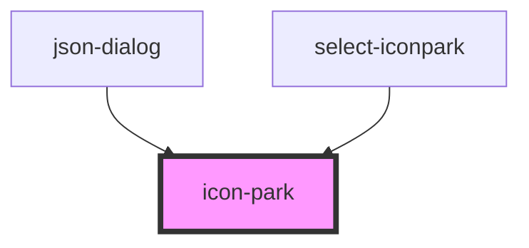

# j-icon

<!-- Auto Generated Below -->

## Properties

| Property         | Attribute         | Description | Type                                                   | Default     |
| ---------------- | ----------------- | ----------- | ------------------------------------------------------ | ----------- |
| `class`          | `class`           |             | `string`                                               | `undefined` |
| `cusLoad`        | `cus-load`        |             | `boolean`                                              | `false`     |
| `fill`           | `fill`            |             | `string \| string[]`                                   | `undefined` |
| `name`           | `name`            |             | `string`                                               | `undefined` |
| `size`           | `size`            |             | `number \| string`                                     | `undefined` |
| `spin`           | `spin`            |             | `boolean`                                              | `undefined` |
| `strokeLinecap`  | `stroke-linecap`  |             | `"butt" \| "round" \| "square"`                        | `undefined` |
| `strokeLinejoin` | `stroke-linejoin` |             | `"bevel" \| "miter" \| "round"`                        | `undefined` |
| `strokeWidth`    | `stroke-width`    |             | `number`                                               | `undefined` |
| `theme`          | `theme`           |             | `"filled" \| "multi-color" \| "outline" \| "two-tone"` | `undefined` |

## Methods

### `load() => Promise<void>`

#### Returns

Type: `Promise<void>`

## Dependencies

### Used by

 - [json-dialog](../Dialog)
 - [select-iconpark](../SelectIconPark)

### Graph

----------------------------------------------

*Built with [StencilJS](https://stenciljs.com/)*
