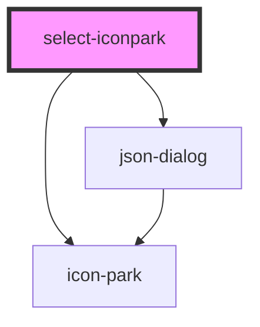

# select-iconpark

<!-- Auto Generated Below -->

## Properties

| Property       | Attribute       | Description | Type      | Default           |
| -------------- | --------------- | ----------- | --------- | ----------------- |
| `escCloseable` | `esc-closeable` |             | `boolean` | `true`            |
| `header`       | `header`        |             | `string`  | `'Icon Park 图标库'` |
| `maskClosable` | `mask-closable` |             | `boolean` | `true`            |
| `maxHeight`    | `max-height`    |             | `string`  | `'80vh'`          |
| `show`         | `show`          |             | `boolean` | `undefined`       |
| `showClose`    | `show-close`    |             | `boolean` | `true`            |
| `showDivider`  | `show-divider`  |             | `boolean` | `true`            |
| `showFooter`   | `show-footer`   |             | `boolean` | `true`            |
| `top`          | `top`           |             | `string`  | `'15vh'`          |
| `value`        | `value`         |             | `string`  | `''`              |
| `width`        | `width`         |             | `string`  | `'50%'`           |

## Events

| Event    | Description | Type                  |
| -------- | ----------- | --------------------- |
| `change` |             | `CustomEvent<string>` |

## Methods

### `close() => Promise<void>`

#### Returns

Type: `Promise<void>`

### `open() => Promise<void>`

#### Returns

Type: `Promise<void>`

## Dependencies

### Depends on

- [json-dialog](../Dialog)
- [icon-park](../IconPark)

### Graph

----------------------------------------------

*Built with [StencilJS](https://stenciljs.com/)*
